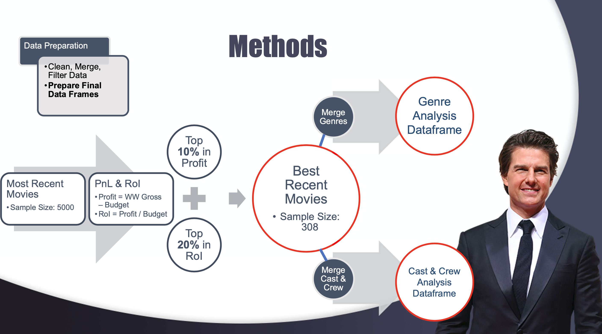

# Tom Cruise Cannot Lose

**Authors**: Victor Kang

## Overview

In today's modern world, especially during and after the pandemic, the movie industry is mightily struggling to stay afloat and get back to normal. A single bad movie could spell the financial doom of an entire studio! That's why every decision a studio makes has taken on exponential weight and risk. That is why most movie studios are turning to data science to help guide their decision making! In this notebook, financial performance data from publicly-available online movie databases will be analyzed to identify only the most successful movies out of the most recent 5000 released movies to-date. Relationships, trends, and metrics will be explored to produce budget, genre, and cast and crew recommendations that will give a new movie studio their best chance at making their first financially successful debut movie!

***
## Business Problem

Microsoft has been suffering from a severe case of FOMO (Fear-Of-Missing-Out) as they've watched many of their competitors succeed in opening up their own movie studios and creating original video content! Microsoft wants in on the action and is now opening their own movie studio! I've been tasked with providing critical data-based market research to ensure that Microsoft's first movie will be a global success!

***
#### Primary Objectives and Qualifications:
1. Explore and analyze what **types** of films are **currently** doing the **best at the box office**.
* The key terms here in bold must first be defined. For this Project, they shall be defined as follows:
>* **Types**: There are many ways to classify or categorize films, most common being by Genre. We can also categorize movies by their budget range, ie. big budget vs small budget.
>* **Currently**: Because Microsoft asked for "currently", we know we should only consider modern movies in our upcoming analysis. Exactly how modern will be influenced by our available data. Specific Date Range To Be Determined! But we should at minimum aim to include movies released this year (2022)!
>* **Best at the Box Office**: "Best" will be defined solely by the financial performance of movies at the Worldwide Box Office. To measure financial performance, we will explore the Worldwide Box Office Gross of movies and compare it to their Production Budgets to calculate the *Profit/Loss* and *Return-On-Investment* metrics.  

* In short, our first objective is to determine which Genres and Budget Ranges of modern movies have produced the highest profit and return-on-investment for their movie studios! 

2. Provide **(3) actionable insights / concrete business recommendations** based on the analysis. 
* We plan to provide budget range recommendations and how budgets could have a relationship to financial success.
* Genre Recommendations
* Recommendations for cast and crew! Actor, Actress, Director, and Writer recommendations.
***

## Data

### Prelimary Data Exploration

Provided Data for Project:
* **Box Office Mojo**, compressed CSV file
* **Rotten Tomatoes**, 2 compressed TSV files
* **TheMovieDB**, compressed CSV file
* **The Numbers**, compressed CSV file
* **IMDB**, SQLlite database

In my search for up-to-date and current movie data, I was able to find (3) outside sources to supplement our datasets as follow:
> 1. **movie_gross_data.csv** : Maintained Box Office Mojo dataset; From Kaggle https://www.kaggle.com/
> 2. **movies budgets.csv** : Maintained comprehensive movie dataset including Budgets; From Kaggle https://www.kaggle.com/
> 3. Below files were the latest individual IMDB table downlaods. Data courtesy of IMDb. https://datasets.imdbws.com/
***only bolded files were used and included in the zippedData folder of the repository**
>* **name.basics.tsv.gz**
>* title.akas.tsv.gz
>* **title.basics.tsv.gz**
>* title.crew.tsv.gz
>* title.episode.tsv.gz
>* **title.principals.tsv.gz**
>* title.ratings.tsv.gz
***

## Methods

Our objective is to discern what types of modern movies perform the best financially. We can simplify this objective by breaking it down into (2) general steps.

* **Step 1**: Generate Data Sets of Financially Successful Modern Movies
* **Step 2**: Perform Data Analysis of Types found in Data Set

To measure financial performance, we stated that we are going to calculate the *Profit/Loss(PnL)* and *Return-On-Investment(RoI)* metrics for each movie. Let's define what those are mathematically:

> $PnL = (Total Worldwide Box Office Gross) - (Production Budget)$

> $RoI = (PnL)/(Production Budget)$

For a movie to be considered a financial success, a movie must generate profit($), but also have a high rate of return (%). 
Let's generate a combined, cleaned, and filtered data set of only modern movies that meet both of the high PnL and high RoI criteria.

With that data set, we will in parallel merge genre data for genre analysis, and merge principal data for cast and crew analysis.


***

## Analysis

We will begin by exploring production budgets and to see if they have any relationships to total box office gross, profit/loss, and return-on-investment. Judging by any trends and patterns we find, we will formulate a budget recommendation.

Then, we will use the merged genre data to analyze the most frequently occuring genres. We can group by genre and look at aggregated statistics to see how different genres typically perform. This will help us make a genre recommendation.

Lastly, we will use the merged cast and crew data to explore the aggregated statistics per individual director, writer, actor, and actress. We should be able to recommend the best fitting castt and crew that also meet our budget and genre trends.

## Conclusions

In today's modern world, a movie's financial performance defines it's success. Studios are only interested in Profit and their Return-On-Investment. 

Based off the data analysis, I would recommend to Microsoft's new Movie Studio to secure a **production budget of ~$125M** to make the next **Action & Adventure** movie starring **Tom Cruise** and **Emma Watson**, with **Anthony Russo** directing a story written by **Christophr Markus**.

This combination is almost guaranteed to be the greatest movie of all time.
***

## For More Information

Please review the full analysis in [the Jupyter Notebook](./dsc-phase1-project-FINAL.ipynb) 
or the [presentation](./Tom Cruise Cannot Lose - Presentation.pdf)

For any additional questions, please contact **Victor Kang - mr.victorkang@gmail.com**

## Repository Structure

Describe the structure of your repository and its contents, for example:

```
├── README.md                                     <- The top-level README for reviewers of this project
├── dsc-phase1-project-FINAL.ipynb                <- Final narrative documentation of analysis in Jupyter notebook
├── dsc-phase1-project-template.ipynb             <- Dirty notebook showing previous work
├── Tom Cruise Cannot Lose - Presentation.pdf     <- PDF version of project presentation
├── zippedData                                    <- Both sourced externally and generated from code
└── images                                        <- Both sourced externally and generated from code
```
